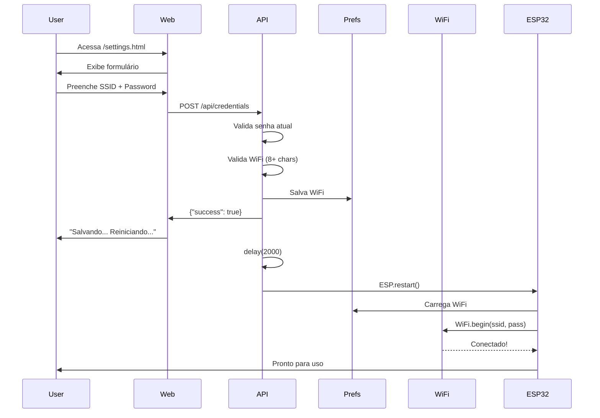

# Configuração WiFi via API

## Visão Geral

A partir desta versão, o sistema permite configurar as credenciais WiFi (SSID e senha) através da interface web de configurações, sem precisar usar o WiFiManager ou resetar o dispositivo.

## Como Funciona

### 1. Interface Web

Acesse a página de configurações (`/settings.html`) e você verá duas seções:

- **🔐 Credenciais da API**: Para alterar usuário e senha da API
- **📶 Configuração WiFi**: Para alterar SSID e senha do WiFi

### 2. Alterando WiFi

1. Digite sua **senha atual da API** (obrigatório para confirmar)
2. Preencha o **SSID** da nova rede WiFi
3. Preencha a **senha** da nova rede (mínimo 8 caracteres)
4. Clique em **💾 Salvar Alterações**

**Importante**: 
- Se você fornecer apenas SSID sem senha, o sistema rejeitará
- Se você fornecer apenas senha sem SSID, o sistema rejeitará
- A senha WiFi deve ter no mínimo 8 caracteres

### 3. Após Salvar

O dispositivo irá:
1. Salvar as credenciais WiFi no Preferences (EEPROM)
2. Reiniciar automaticamente em 2 segundos
3. Tentar conectar na nova rede WiFi
4. Se falhar, voltará ao modo WiFiManager (AP mode)

## Comportamento Técnico

### ESP32 (Produção)

1. **Inicialização**:
   - Carrega credenciais WiFi salvas do Preferences
   - Tenta conectar na rede salva (timeout de 10 segundos)
   - Se falhar, inicia WiFiManager em modo AP

2. **Armazenamento**:
   - WiFi SSID: `prefs.getString("wifi", "ssid")`
   - WiFi Password: `prefs.getString("wifi", "password")`
   - Persistido em EEPROM

3. **Endpoint**: `POST /api/credentials`
   - Aceita `wifi_ssid` e `wifi_password`
   - Valida senha atual da API
   - Salva no Preferences
   - Reinicia ESP32

### Dev-Server (Desenvolvimento)

1. **Simulação**:
   - Aceita as mesmas requisições que o ESP32
   - Loga as configurações WiFi no console
   - **Não aplica** as configurações (apenas simula)
   - Reinicia o servidor Node.js

2. **Endpoint**: `POST /api/credentials`
   - Aceita `wifi_ssid` e `wifi_password`
   - Valida mas não aplica
   - Útil para testar a interface sem afetar o WiFi real

## Exemplo de Requisição API

```bash
curl -X POST http://192.168.1.100/api/credentials \
  -u admin:senha123 \
  -H "Content-Type: application/json" \
  -d '{
    "current_password": "senha123",
    "wifi_ssid": "MinhaRedeWiFi",
    "wifi_password": "SenhaSegura123"
  }'
```

Resposta:
```json
{
  "success": true,
  "message": "Credentials updated successfully. Device will restart in 2 seconds.",
  "username": "admin",
  "note": "ESP32 will restart to load new credentials from EEPROM"
}
```

## Validações

### Client-Side (JavaScript)
- Senha atual obrigatória
- Se forneceu WiFi password, SSID é obrigatório
- Se forneceu SSID, WiFi password é obrigatório
- WiFi password mínimo 8 caracteres

### Server-Side (ESP32/Dev-Server)
- Senha atual deve estar correta
- WiFi SSID + password devem vir juntos
- WiFi password mínimo 8 caracteres
- API password mínimo 6 caracteres (se fornecida)

## Internacionalização

Todas as labels e mensagens estão traduzidas:

- **English**: `wifiConfig`, `wifiSSID`, `wifiPassword`, etc.
- **Português BR**: `wifiConfig`, `wifiSSID`, `wifiPassword`, etc.

## Segurança

1. **Autenticação**: Requer HTTP Basic Auth para acessar
2. **Senha Atual**: Necessário fornecer senha atual para confirmar
3. **Criptografia**: WiFi password é armazenado em texto plano no Preferences (EEPROM)
4. **HTTPS**: Recomenda-se usar HTTPS em produção

## Troubleshooting

### WiFi não conecta após mudança

1. **Verifique SSID**: Case-sensitive, espaços importam
2. **Verifique senha**: Mínimo 8 caracteres, WPA2
3. **Reset WiFi**: Use o botão físico ou endpoint `/api/reset`
4. **WiFiManager**: Conecte ao AP "MUST-PV19-CONFIG" para reconfigurar

### Dev-server não aplica WiFi

Isso é **esperado**! O dev-server apenas simula e loga no console. Para testar WiFi real, use o ESP32.

### Credenciais não são salvas

1. **Verifique Preferences**: Certifique-se que a biblioteca está incluída
2. **EEPROM**: Verifique se há espaço suficiente
3. **Logs Serial**: Monitore com `pio device monitor`

## Fluxo Completo



## Compatibilidade

- **ESP32**: ✅ Suportado
- **ESP32-C3**: ✅ Suportado
- **ESP32-S3**: ✅ Suportado
- **ESP8266**: ⚠️ Não testado (pode precisar ajustes)

## Próximos Passos

- [ ] Adicionar suporte para WiFi Enterprise (WPA2-EAP)
- [ ] Adicionar endpoint separado `/api/wifi` (opcional)
- [ ] Adicionar lista de redes disponíveis (scan)
- [ ] Adicionar validação de força do sinal antes de salvar
